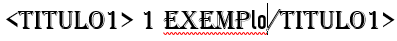
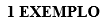

<h1 align="center"> AlgoritmoABNT </h1>

##  Como usar?

- ``O algoritmo funciona semelhante ao html, ou seja, através de tags``
- ``Antes de usar o arquivo, coloque essas tags no texto antes de rodas o algoritmo``
- ``Por exemplo:``
- ``titulo de nivel 1 - <title1> COLOQUE AQUI O TITULO </title1> ``

- ``Resultado:``

- ``Com apena isso seu titulo sera alinhado. Funciona assim para as demais tags``

# 📘 Lista de tags
- ``Titulo nível 1 - <title1> </title1>``
- ``Titulo nível 2 - <title2> </title2>``
- ``Paragrafo - 
 
``
- ``As tabelas não é preciso de tag, ja ajusta automaticamente``

# :hammer: O que ele faz(atualmente)

- `Funcionalidade(atuais)`: Atualmente ele ajusta tabelas, paragrafos, titulos de nível 1 e 2. 
- `Funcionalidade(Serão adicionadas posteriormente)`: Posteriormente será adicionado as seguintes funcionalidades:
- `Na próxima implementação`: Sumário automatico e configuração para imagens.
- `No futuro`: Referências, capa e contra-capa.
- Essas não serão todas as funcionalidades, mas as próximas.

## ✔️ Tecnologias utilizadas

- ``Python3``
- ``python-docs 1.1.2``

